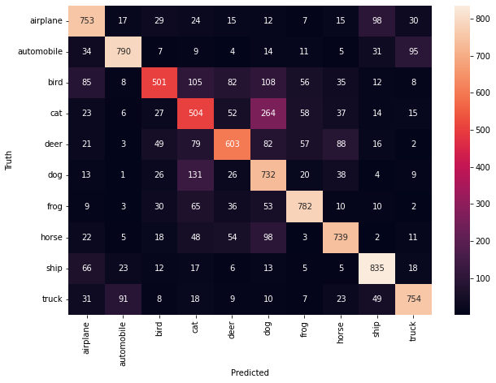

# 🖼️ Image Classification using CNN (CIFAR-10)

## 📌 Project Overview
In this project, I developed a **Convolutional Neural Network (CNN)** to classify low-resolution (32x32) color images into 10 distinct categories. This project demonstrates the power of Deep Learning in identifying spatial hierarchies and patterns in visual data.

## 🛠️ Tech Stack
* **Framework:** TensorFlow / Keras
* **Libraries:** NumPy, Matplotlib, Seaborn, Scikit-Learn
* **Dataset:** CIFAR-10 (60,000 images across 10 classes)

## 🏗️ Model Architecture
The network consists of a series of convolutional and pooling layers designed to extract features from edges to complex shapes:
1. **Convolutional Layer 1:** 32 filters (3x3), ReLU activation.
2. **Max Pooling:** 2x2 downsampling.
3. **Convolutional Layer 2:** 64 filters (3x3), ReLU activation.
4. **Max Pooling:** 2x2 downsampling.
5. **Convolutional Layer 3:** 64 filters (3x3).
6. **Fully Connected (Dense):** 64 neurons leading to a 10-node output layer.

## 📊 Performance & Evaluation
* **Final Test Accuracy:** **69.93%** after 10 epochs.
* **Optimization:** Used `Adam` optimizer and `SparseCategoricalCrossentropy` loss.

### Confusion Matrix Analysis

By analyzing the confusion matrix, I identified key behaviors of the model:
* **High Precision:** The model performed exceptionally well on **Ships** (835 correct) and **Automobiles** (790 correct).
* **Class Confusion:** The highest error rate occurred between **Cats and Dogs**, where 264 cats were misidentified as dogs, highlighting the challenges of classifying similar organic shapes in low resolution.

## 🚀 How to Run
1. Clone the repository.
2. Install dependencies: `pip install tensorflow matplotlib seaborn scikit-learn`.
3. Run the notebook: `jupyter notebook image-classification-cnn.ipynb`.
